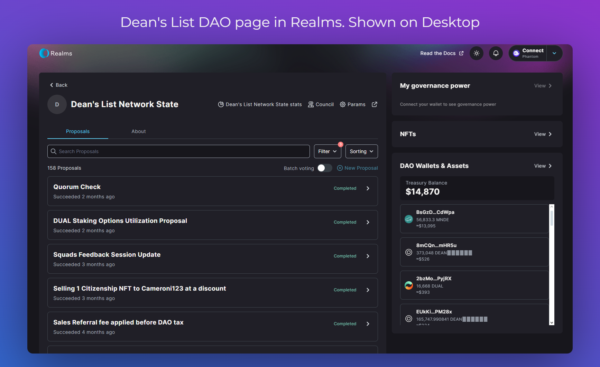
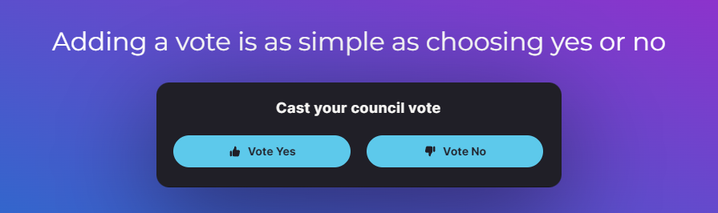
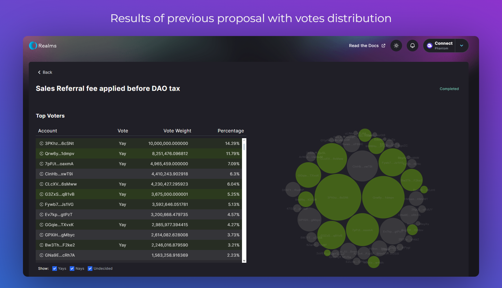

# Realms Platform

## Onboarding

Just like multiple different Solana projects, our DAO interface makes use of Realms.
Open up [our DAO page](https://app.realms.today/dao/F9V4Lwo49aUe8fFujMbU6uhdFyDRqKY54WpzdpncUSk9) on their website.

## Voting

Remember to use correct account with your $DEAN tokens. After connecting with a wallet you should be able to see your voting power, option to create proposals, and vote in already existing ones.
Casting your vote requires choosing `yes` or `no` and signing transaction to prove ownership of wllet and send information to the Blockchain. Your vote power is dependent on amount of tokens in your balance.

## Historical Proposal Details

To view details of historical proposals, firstly choose one that you want to inspect by clicking on it. Then click on `Explore` button in `Results` section.

You'll be presented with detailed view and breakdown of votes on given proposal.

