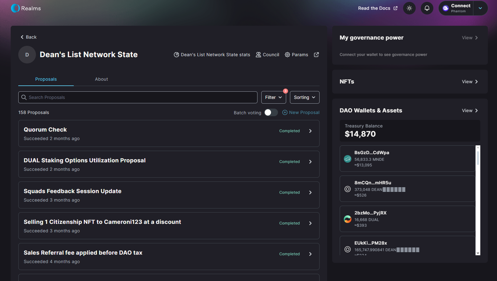

# Realms PLatform Tutorial

## Onboarding

DAO interface makes use of Realms. To open up our DAO page, click [here](https://medium.com/@deanmachine/wen-one-of-us-sir-deans-list-token-airdrop-9436d01bb447).

After connecting with a wallet you should be able to see your voting power, option to create proposals, and vote in already existing ones.

## Historical Proposal Details

To view details of historical proposals, firstly choose one that you want to inspect by clicking on it. Then click on `Explore` button in `Results` section.

You'll be presented with detailed view and breakdown of votes on given proposal.

