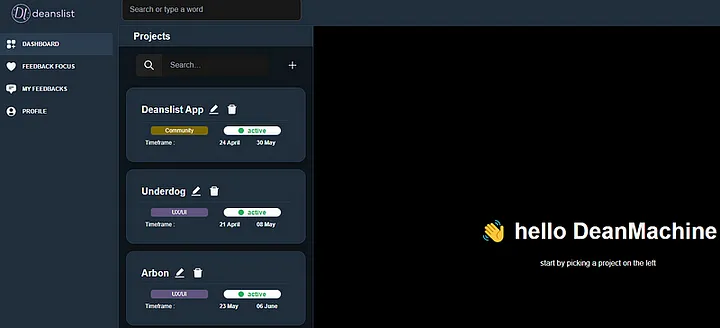

# Tokenomics

Non-fungible tokens. Governance tokens. Payment tokens. Security tokens. Privacy coins. Stablecoins. Exchange tokens. Utility tokens. Meme coins. Soulbound tokens.

This might not be an exhaustive list, and its very likely the list will only grow in the years to come. As people get to wrap their heads around tokenization, more and more innovations are inevitable. Each new experiment brings with it new ideas and challenges.

Decentralized communities have played with a handful of these types of tokens; governance tokens to vote on DAO proposals, meme coins to compensate contributions to the community, payment tokens to charge for products and services provided by the community to 3rd parties.

We’ve found that there are flaws in each of these; they are solutions that dont quite fit our needs at Dean’s List as a serviceDAO/Network State.

-Governance tokens are plutocratic by nature and vulnerable to governance attacks
-Meme coins as compensation are extremely volatility
-All of these are subject to speculators and pump/dump schemes

A new token model is needed that can be used exclusively by its own community. Enter $DEAN token

From distribution to allocation, we did everything we set out to accomplish with our new token launch.

**Now its time to expand our ambitions and introduce a new token model for decentralized communities: Participation Tokens.**

_Before diving in to our new token model, it’s essential to understand our initial distribution process and our focus on high quorum and contribution. You can learn about our $DEAN token’s Phase 1 [here](https://medium.com/@deanmachine/wen-one-of-us-sir-deans-list-token-airdrop-9436d01bb447):_

## What does the Token do

As a Network State for Early Adopters, our main focus has been to help new protocols and technologies find product market fit and provide them detailed and actionable user feedback. On average, new members generate $50 in their first month; this has lead to a massive increase in new applicants looking to join. However, not all of these new applicants are participating in new work. This leads to wasted effort in validating their application since they ultimately don’t end up adding value.

In short, we’re starting to get spammed because of our success.

Our new concept is to use the token as a participation token to help combat this spam and to kickstart our exploration into reputation applications.

The philosophy behind a participation token is to protect the time of your reputable members. In every community there are tasks that are low value but must be delegated to people of high trust/reputation. Looking at applications is an example of this kind of task. Just like how college applications have a submission fee, these participation tokens would help protect their time and would also compensate them for doing these otherwise valueless tasks.

The token is without speculation as the value is capped by two dynamics

- The token is pegged to $0.10 USDC and issued by us (until the mint authority is burned)
- The value of the token is capped by the owners effort + the payout for a task. _(The current average is $5 worth of token + work = $50) This means that the tokens maximum value is unlocked by contributing in our DAO._

DAO governance token attacks are also removed. The token will serve as a governance polling mechanism, replacing token governance for a multi-sig reputation based approach. Our community funds are currently spread across 6 multi-sigs and most likely this number will increase. The token is used for sentiment voting and, in most instances, the multi-sig owners will honor the majority and quorum. Our election process will be further developed over the next 6 months.

## 1) Participation

Want to participate in working on feedback with a group of power users? That’s going to cost you 50 $DEAN tokens. The manager of that feedback session (a fellow Dean’s List member) needs to read everyone’s submissions, grade them, and make sure they are of high quality to ensure clients are happy with the end result.

Those tokens are then re-distributed in a schema to ensure circulation

**An example schema would be**

- 10% of the token amount is kept by the manager of the task
- 20% of the token amount is sent back to the DAO treasury
- 70% of tokens are added back into the NFT staking pool

Today, the first use for this token is to extend a business visa (it costs 50 $DEAN tokens). The business visa application can be found [here](https://medium.com/@deanmachine/wen-one-of-us-sir-deans-list-token-airdrop-9436d01bb447).

**Business Visa — Dean’s List DAO on trial-mode**

Business Visas are currently issued for 30 days and they are free to apply for. This is how we allow new members into our DAO with no cost; a true meritocratic entry. New members have the ability to earn more than enough USDC to then come back and renew their Business Visa, or even save up for full NFT citizenship! This model works because the token acts as an anti-spam fee; both keeping frivolous applications out and keeping work quality high.

In the near future, these tokens will also be used directly on our feedback work application, where each task manager can calibrate how many tokens they are requiring for participants to contribute in the feedback session

## 2) Token-Curated Registry

We’re still in the early days of ideation here, but the logic is that these are tokens that have no speculative value and are primarily in the hands of high activity, high contribution members that are extremely knowledgeable and dedicated to Solana.

There are a number of ways to use this decision-making to better the ecosystem:

- Validate new tokens onto token lists for wallets
- Validate new DAOs to keep Realms and other DAO discovery platforms uncluttered
- Certify new NFT collections to protect from rugs

Because there is no market for the tokens and no redeem-ability for the tokens outside of DAO work, the likelihood they are purchased specifically for voting is diminished (compared to other token models).

## How to get the new token

Unlike most tokens, we are not creating a market for these tokens. You can ONLY get your hands on $DEAN token through:

- Receive them for staking our citizen NFT
- Receive a token option (powered by Dual Finance). The first recipients of our token options are the attendees of the Superteam ecosystem call and are exercisable for 0.0001 USDC per token, expiring July 1st. You can read how to redeem these options here

In the near future, you’ll be able to purchase the tokens directly from our DAO at a pegged rate of $0.10 USDC per token.

## What are the Tokenomics

_Current Circulation — 52,500,570_

50,000,000 of these tokens were distributed to members of Dean’s List DAO based off of community involvement.

All tokens are held by contributing community members. There are no vesting tokens, no lockups, no secret allocations!

You can find more details around the distribution here in this [twitter thread](https://medium.com/@deanmachine/wen-one-of-us-sir-deans-list-token-airdrop-9436d01bb447).

**The mint authority is owned by a Squads 5/10 multi-sig:** [https://solscan.io/account/FAEYozsZVkxhXwG1HnVJn58Ks3dff31zjtA8b3KezFJ6](https://solscan.io/account/FAEYozsZVkxhXwG1HnVJn58Ks3dff31zjtA8b3KezFJ6)

The token address is: _Ds52CDgqdWbTWsua1hgT3AuSSy4FNx2Ezge1br3jQ14a_

The biggest users of the token are the existing holders. These tokens circulate through tasks, making their way back into our staking pool and DAO treasury. Those tokens go back into circulation through staking and purchases from our DAO owned store.

One of the biggest flaws of this model is when someone simply gathers token without participating. Hoarding requires constant adjustments of participation amounts, staking releases, and re-distribution schemas. It makes little sense to hoard, but it is also possible this will simply be a by-product of inactivity.

**Future tokens will be minted for:**

- Airdrops through token options issued by Dual Finance
- Staking rewards for our NFT holders
- Something else (likely nothing else, but we know we haven’t thought of everything!)

As a community, we currently support burning the mint authority within the next 6 months. One reason we would decide not to burn the mint authority lies in the uncertainty of circulation, hoarding, and other dynamics that may affect the tokens ability to be a participation token.

## Next steps

**Finish airdrops.** We have quiet a few target communities in mind, but we are in no rush and we want to make sure we are considering new contributors who actively vote. The first airdrop will play a major role in how many more tokens we will airdrop in the future .

**Add participation token-gating to more tasks.** Increasing our token economy circulation will help us better understand what our eventual circulating amount will be and how much of that will flow back through NFT staking

**Reputation metrics.** The ultimate goal is to use a reputation metric to:

- Set how many tokens each NFT token holder is receiving
- Set the cost per task

**for example: a member with more reputation will spend less participation tokens on a task compared to a zero reputation member who will pay more participation tokens**

**Burn the mint authority.** Once our participation economy has been operational for at least 6 months, we expect to have enough information to properly assess how many tokens need to exist, the staking release, and the correct participation token tax. At this point, we can remove the mint authority. As a community that has rebooted our token multiple times, there are few fears that someone finding a flaw in our incentive logic will be long-term detrimental. We have and we will continue to innovate in token dynamics for decentralized communities!

Thank you for reading about our new contribution to decentralized community theory. **Now go out there and start participating!**
