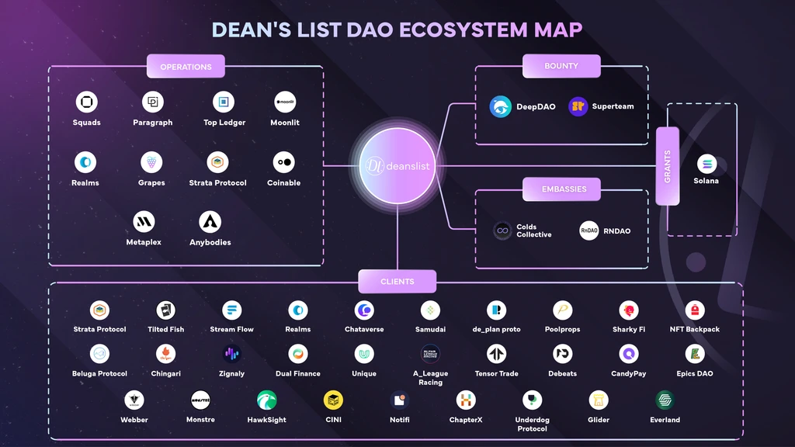

# Hire Us

# Web3 Insights, Next-Level Success

_We've been here for a while, made a couple friends along the way…and would love to get to know you too!_

## Our Processes

Every protocol we review is assigned a Manager who acts as a bridge between the project team and the community. **Our deep dive spans a 2 week period** where our community of power users dissect through your protocol and social infrastructure delivering valuable feedback on:

- UI / UX improvements
- GTM strategy
- Proofing your socials
- User Insights derived from blockchain data
- Feature requests for experience improvement

The end result is packaged in a neat document for ready perusal by the team to address in their own time.

## Our Clients

Despite our Network State being relatively young, we have the distinction of having worked with some of the biggest names in the Solana Ecosystem already. This is testament to the value we bring to our clients and the ecosystem's continued faith in us.

Whether it be Wallets, DeFi, Marketplaces, the Creator Economy, Gaming, Public Goods, Infrastructure, Governance Models or any other vertical you can think of, we pride ourselves for having delivered actionable feedback as a community.

## Case Studies

Here is a flavour of how we have helped some of the best protocols achieve the best results.

- [Underdog Protocol](https://www.underdogprotocol.com)
- [dReader](https://dreader.io)
- [Sujiko](https://sujiko.trade)
- [Tensor](https://www.tensor.trade)
- [Squads](https://squads.so)
