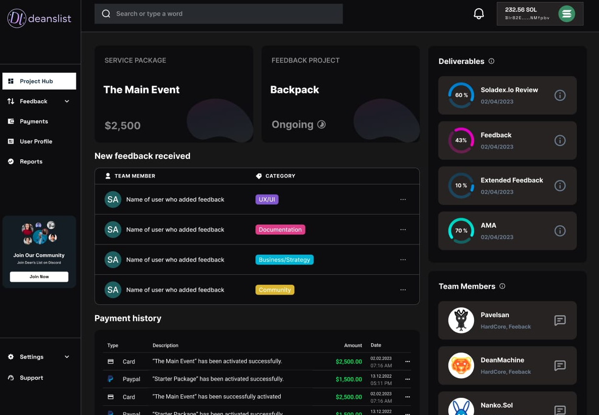

# Built on Solana For All Of Web3

## The Tools We Are Building:

To streamline workflows and take them on-chain, we are currently developing a dashboard that would serve to provide real time transparency to our customers as to the progress on their purchased services while equipping our citizens with the requisite information on the available opportunities they can participate in. At the heart of this is a Wallet based sign in for our citizens and our customers, which will help propel us to greater decentralisation and automation.

## The Tools We Are Using:

| Tool               | Description                                                                                                                                                                                                                                                                                                                                                                                                                                                                                                                                                                                                                                                                           |
| ------------------ | ------------------------------------------------------------------------------------------------------------------------------------------------------------------------------------------------------------------------------------------------------------------------------------------------------------------------------------------------------------------------------------------------------------------------------------------------------------------------------------------------------------------------------------------------------------------------------------------------------------------------------------------------------------------------------------- |
| **Realms**         | This is our main treasury and governance platform. All votes happen here, both with and without instructions assigned to them. As a highly active and connected DAO, our quorum is regularly above 50%, with a vote time threshold that lasts only 24 hours. This allows our citizens to rapidly decide and evolve to new opportunities & challenges.                                                                                                                                                                                                                                                                                                                                 |
| **Squads**         | This is primarily used for our Department budgets which require even faster consensus. As a multisig, these departments are able to deploy their capital without concern to the greater DAO thus ensuring that operations run smoothly on a day to day basis.                                                                                                                                                                                                                                                                                                                                                                                                                         |
| **Strata Protoco** | This is the token-bonding solution that powers our flexible token, $DEAN. By having a predictable bonding curve and royalties set on the swaps, we are able to remove speculation from our governance token and also create a dynamic liquidity option for services to be taxed as they are paid for. Royalties can be adjusted by Realms vote and are all sent to our common Treasury governed by the $DEAN token. We are fascinated to explore the boundaries of bonded tokens, which is where we started when we created $DEAN, backed by $GRAPE. We have now set our plan in motion to the path of a USDC backed token by moving to an interim token solution (minted on Squads). |
| **Coinable**       | This is our ecommerce solution that accepts SPL payments for services. By using a web3 solution, we can instantly send these payments into our Realms Treasury.                                                                                                                                                                                                                                                                                                                                                                                                                                                                                                                       |

## The Tools We'll Need:

- Token-bonding connected to USDC
- Royalty and curve adjustment through Realms
- Multi-transaction sending from Coinable for enforced royalties/taxation
- Verification updated by Realms for role assignment by DAO
- Reputation system measuring contribution and reliability
